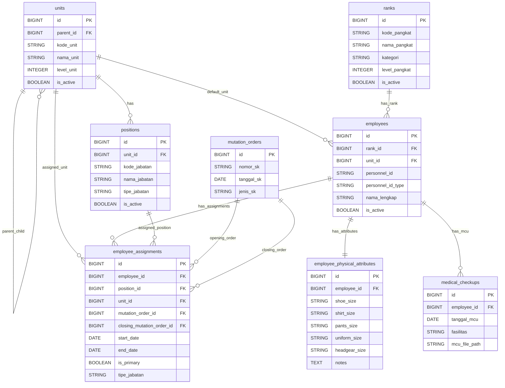

# PRD Aplikasi Personalia RS Militer

**Versi:** 2.0
**Status:** Stabil untuk MVP — Scope 1 Demo Selasa
**Tanggal:** 28 Mei 2026
**Pemilik PRD:** Tim IT RS Militer
**Sumber Kebutuhan Fungsional:** Dirbinyankes (dr. Wildan Sani, Sp.U)

---

## Tentang Dokumen Ini

PRD ini menjadi referensi tunggal untuk implementasi PATCH A–N. Dibangun di atas keputusan yang sudah dikunci di sesi review sebelumnya. Tidak boleh ada perubahan arsitektur tanpa update PRD.

**Cara membaca:**
- §1–§4: konteks dan kunci pengambilan keputusan
- §5–§8: arsitektur data dan modul (referensi implementasi utama)
- §9–§15: rencana eksekusi dan risiko
- Appendix A–B: data dictionary lengkap dan permission matrix

**Konvensi:**
- AC ID format: `<MODUL>-AC-<NN>` (contoh: `EMP-AC-01`)
- Field STRING = `varchar(255)` default kecuali disebut TEXT
- Semua tabel pakai PK `id BIGINT autoincrement`
- Timezone: `Asia/Jakarta`

---

## §1. Ringkasan Eksekutif

Aplikasi internal berbasis intranet untuk RS Militer yang mengelola data personel, struktur organisasi, pangkat, jabatan, surat keputusan, riwayat penugasan, atribut fisik, dan dokumen MCU PDF. Dirancang dengan auditability sejak awal, RBAC sederhana 3-peran untuk MVP, dan deployment tertutup tanpa internet egress.

| Area | Keputusan |
|---|---|
| Platform | Laravel 10/11, Filament v3, Livewire 3, MySQL/MariaDB |
| Auth | Login email (Laravel default), Spatie Permission + manual Laravel Policy |
| Audit | spatie/laravel-activitylog untuk entitas wajib audit |
| Deployment | Closed intranet, IP whitelist, no internet egress |
| RBAC Scope 1 | 3 role: SuperAdmin, Admin Personalia, Viewer |
| Highlight Dirbinyankes | Physical Attributes (form Section) + MCU PDF (upload restricted) |
| Excluded MVP | Payroll, attendance, leave, dashboard analitik, bulk import, EMR, inventory atribut |

---

## §2. Keputusan yang Sudah Dikunci

Tabel ini adalah single source of truth untuk semua design decision yang sudah dikonfirmasi product owner. Tidak boleh diubah tanpa dokumentasi update PRD.

| ID | Topik | Keputusan |
|---|---|---|
| D-01 | Personnel Identifier | `personnel_id` (STRING, UNIQUE, NOT NULL) + `personnel_id_type` ENUM('NRP','NIP','LAINNYA') — bukan kolom terpisah `nrp`/`nip` |
| D-02 | Login Credential | Email (Laravel default). `personnel_id` bukan credential login. Dual-login (email atau NRP) = future enhancement |
| D-03 | Authorization MVP | Manual Laravel Policy + Spatie Permission untuk role storage. **Tidak pakai filament-shield di MVP** |
| D-04 | RBAC Scope 1 | 3 role saja: SuperAdmin, Admin Personalia, Viewer. RBAC medis 7-role = Scope 2 |
| D-05 | MCU Scope 1 | Upload PDF + view PDF only. Akses eksklusif Admin Personalia + SuperAdmin. Viewer dilarang total |
| D-06 | MCU Storage | Disk `private`, path `storage/app/private/mcu/{employee_id}/{hash}.pdf`. Akses via signed temporary URL (5 menit) |
| D-07 | Physical Attributes UI | **Section di EmployeeResource form**, bukan Relation Manager (karena relasi 1:1) |
| D-08 | Physical Attributes Data | Mutable, current value only, NO history table, perubahan WAJIB audited |
| D-09 | Mutation Order Lock | Mutable selamanya untuk SuperAdmin. Mutable untuk Admin Personalia hanya jika belum direferensikan EmployeeAssignment |
| D-10 | Overlap Rule (Position) | Position struktural max 1 holder aktif (`end_date IS NULL`) |
| D-11 | Overlap Rule (Employee) | Setiap Employee max 1 assignment aktif dengan `is_primary=true`. Multi-active non-primary boleh |
| D-12 | tipe_jabatan Denormalisasi | `assignment.tipe_jabatan` auto-fill dari `position.tipe_jabatan` saat create, immutable setelah save |
| D-13 | Immutability Closed Assignment | Policy `update=false` & `delete=false` saat `end_date` terisi untuk Admin Personalia. SuperAdmin tetap bisa via koreksi historis (Scope 2) |
| D-14 | Soft Delete vs Hard Delete | Hard delete dilarang untuk semua role. SuperAdmin pakai soft delete (`deleted_at`) sebagai mekanisme "delete" |
| D-15 | Tipe Data Konvensi | STRING untuk identitas/kode resmi. INTEGER untuk nilai matematis. TEXT untuk catatan free-form |

---

## §3. Glossary

### 3.1 Istilah Organisasi (Militer)

| Istilah | Definisi |
|---|---|
| Karumkit | Kepala Rumah Sakit |
| Wakarumkit | Wakil Kepala Rumah Sakit |
| Dirbinyankes | Direktur Pembinaan Pelayanan Kesehatan. Saat ini: dr. Wildan Sani, Sp.U. **Sumber kebutuhan fitur medis di PRD ini** |
| Dirbinprogar | Direktur Pembinaan Program & Anggaran. Saat ini: Kol. Choirul Huda. Scope 2+ |
| Dirprofnakes | Direktur Profesional Tenaga Kesehatan. Scope 2+ |
| Kekomed | Kepala Komite Medis. Scope 2+ |
| Kaposkahli | Kepala Pos Ahli. Scope 2+ |
| NRP | Nomor Registrasi Pokok — identitas militer TNI |
| NIP | Nomor Induk Pegawai — identitas PNS |
| MCU | Medical Check-Up |
| SK | Surat Keputusan |
| Mutasi | Perpindahan jabatan/penugasan via SK |

### 3.2 Istilah Aplikasi

| Istilah | Definisi |
|---|---|
| SuperAdmin | Role aplikasi dengan semua hak akses, termasuk koreksi historis |
| Admin Personalia | Role aplikasi pengelola data personalia, akses eksklusif MCU PDF di Scope 1 |
| Viewer | Role aplikasi read-only data umum. Dilarang akses MCU |
| Mutation Order | Entitas SK sebagai dasar pembuka atau penutup Assignment |
| Assignment | Riwayat penugasan personel pada jabatan dan unit tertentu |
| Active Assignment | Assignment dengan `end_date IS NULL` |
| Closed Assignment | Assignment dengan `end_date` terisi. Immutable untuk Admin Personalia |
| `is_primary` | Flag boolean pada Assignment. Setiap Employee max 1 primary active assignment |
| Physical Attributes | Data ukuran atribut personel (sepatu, baju, dst.). Relasi 1:1 dengan Employee |
| MedicalCheckup | Record MCU PDF historis per Employee. Append-only |

---

## §4. Stakeholder & Peran

### 4.1 Stakeholder Organisasi vs Role Aplikasi

Pemisahan ini wajib agar tidak terjadi pencampuran konsep.

| Application Role (Spatie) | Stakeholder Organisasi |
|---|---|
| SuperAdmin | Tim IT RS Militer |
| Admin Personalia | Staf Personalia |
| Viewer | Pimpinan terbatas, staf umum yang butuh read-only |
| _(Scope 2)_ | Karumkit, Wakarumkit, Dirbinyankes, Kekomed, Kaposkahli |

### 4.2 Pemilik Kebutuhan

| Stakeholder | Kebutuhan |
|---|---|
| Tim IT | Maintainable architecture, audit trail, RBAC sederhana |
| Staf Personalia | CRUD personel, mutasi, riwayat penugasan |
| Dirbinyankes | Physical attributes untuk distribusi seragam, arsip MCU PDF |
| Pimpinan terbatas | Read-only data personel umum |

---

## §5. Boundary Scope

### 5.1 IN Scope MVP (Demo Selasa)

| Modul | Sub-Modul |
|---|---|
| Core master data | Unit, Rank, Position, Employee |
| Personnel profile | Physical Attributes (1:1 dengan Employee) |
| Transactional + historis | Mutation Order, Employee Assignment |
| Document archive | MCU PDF (upload + view, no preview) |
| Security & audit | RBAC 3-role, Audit Trail via activitylog |

### 5.2 OUT Scope MVP

| Area | Status |
|---|---|
| Payroll | Tidak akan dibuat |
| Attendance / leave / cuti | Tidak dibuat di MVP |
| Dashboard analitik kompleks | Tidak dibuat di MVP |
| Bulk import personel | Tidak dibuat di MVP |
| MCU PDF preview | Tidak dibuat di MVP (hanya download via signed URL) |
| Workflow approval MCU | Tidak dibuat di MVP |
| Bulk export / reporting | Tidak dibuat di MVP |
| Notifikasi email / push | Tidak dibuat di MVP |
| Mobile app khusus | Tidak dibuat di MVP |
| Integrasi EMR/SIMRS | Scope 2+ |
| Inventory stok atribut | Scope 2+ |
| Uniform issuance workflow | Scope 2 |
| Medical incident workflow | Scope 2 |
| RBAC medis 7-role | Scope 2 |

---

## §6. Arsitektur Data

### 6.1 Klasifikasi Data

Setiap tabel masuk ke satu kategori. Kategori menentukan aturan mutability, audit, dan delete.

| Kategori | Karakteristik | Tabel |
|---|---|---|
| **Master Reference** | Slow-changing, dipakai sebagai lookup | `units`, `ranks`, `positions` |
| **Master Subject** | Subjek utama bisnis | `employees` |
| **Master Document** | Dokumen resmi yang lock setelah dipakai | `mutation_orders` |
| **Profile (1:1)** | Atribut subjek yang mutable, current-only | `employee_physical_attributes` |
| **Transactional + Historis** | Open mutable, closed immutable | `employee_assignments` |
| **Document Archive** | Append-only document records | `medical_checkups` |
| **Audit** | Append-only oleh framework | `activity_log` |
| **Identity** | Spatie + Laravel default | `users`, `roles`, `permissions`, `model_has_*` |

### 6.2 Konvensi Tipe Data

| Jenis | Tipe DB | Contoh Field |
|---|---|---|
| Identitas/kode resmi (boleh leading zero, slash, titik, romawi) | STRING | `personnel_id`, `kode_pangkat`, `kode_unit`, `kode_jabatan`, `nomor_sk`, `golongan` (III/a), `eselon` (II.a) |
| Ukuran atribut (campuran huruf/angka) | STRING | `shoe_size`, `shirt_size`, `pants_size`, `uniform_size`, `headgear_size` |
| Nilai matematis (sort/hitung) | INTEGER | `level_pangkat`, `level_unit`, `sort_order`, `tahun` |
| Tanggal | DATE | `tanggal_sk`, `start_date`, `end_date`, `tanggal_mcu` |
| Waktu (with time) | DATETIME | `created_at`, `updated_at`, `deleted_at` |
| Flag boolean | BOOLEAN | `is_active`, `is_primary` |
| Path file | STRING | `photo_path`, `mcu_file_path`, `file_sk_path` |
| Catatan free-form | TEXT | `catatan`, `ringkasan`, `notes` |
| Enum kecil tertutup | STRING/ENUM | `tipe_jabatan`, `jenis_sk`, `personnel_id_type`, `jenis_personel` |
| Primary key | BIGINT auto-increment | `id` |
| Audit properties | JSON | `activity_log.properties` |

### 6.3 Konvensi Penamaan

| Aspek | Konvensi | Contoh |
|---|---|---|
| Nama tabel | `snake_case`, plural | `employees`, `mutation_orders` |
| Nama field | `snake_case`, singular | `nama_lengkap`, `mutation_order_id` |
| Foreign key | `<table_singular>_id` | `employee_id`, `position_id` |
| Self-reference FK | `parent_id` | `units.parent_id` |
| Boolean field | `is_<adjective>` | `is_active`, `is_primary` |
| Tanggal | `tanggal_*` atau `*_date` (sesuai konteks) | `tanggal_sk`, `start_date` |
| Enum value | lowercase snake_case | `struktural`, `tugas_tambahan`, `pengangkatan` |

### 6.4 ERD Mini Scope 1



> **Catatan ERD:** Diagram di atas hanya menampilkan field esensial untuk visualisasi relasi. Skema lengkap (timestamps, soft delete, index, dst.) ada di **Appendix A**.

---

## §7. Modul Scope 1

Setiap modul disusun dengan format konsisten: **Tujuan → Cardinality → Field Spec → Business Rules → Acceptance Criteria**.

### 7.1 Unit (Organisasi)

| Aspek | Spesifikasi |
|---|---|
| Tujuan | Struktur organisasi RS Militer dalam bentuk tree parent-child |
| Klasifikasi | Master Reference |
| Cardinality | Unit 1:N Unit (self), Unit 1:N Position, Unit 1:N Employee |
| Mutability | Mutable jarang |
| Audit | Optional |
| Tree depth target | Minimal 3 level untuk demo |

**Field utama:** `id, parent_id, kode_unit, nama_unit, level_unit, sort_order, is_active, timestamps, deleted_at`. Skema lengkap di Appendix A.1.

**Business Rules:**
- `kode_unit` unique global, STRING (boleh leading zero)
- `level_unit` digenerate sesuai depth tree (root = 1)
- Soft delete diperbolehkan; restore via SuperAdmin

**Acceptance Criteria:**

| ID | Kriteria |
|---|---|
| UNIT-AC-01 | SuperAdmin dan Admin Personalia dapat CRUD Unit |
| UNIT-AC-02 | Viewer hanya dapat melihat tree Unit, tidak dapat modify |
| UNIT-AC-03 | Tree Unit ditampilkan dengan relasi parent-child di Filament |
| UNIT-AC-04 | `kode_unit` tersimpan sebagai STRING tanpa kehilangan leading zero |
| UNIT-AC-05 | Soft delete tersedia; data tidak langsung hilang dari DB |

---

### 7.2 Rank (Pangkat)

| Aspek | Spesifikasi |
|---|---|
| Tujuan | Daftar pangkat TNI/PNS dengan hierarki ordering |
| Klasifikasi | Master Reference |
| Cardinality | Rank 1:N Employee |
| Mutability | Mutable jarang |
| Audit | Optional |

**Field utama:** `id, kode_pangkat, nama_pangkat, kategori, level_pangkat, sort_order, is_active, timestamps, deleted_at`.

**Business Rules:**
- `kategori` enum: `TNI`, `PNS`, `LAINNYA`
- `level_pangkat` INTEGER untuk ordering hierarki (lebih besar = lebih tinggi)
- Hierarki ordering di UI = `ORDER BY level_pangkat DESC, sort_order ASC`

**Acceptance Criteria:**

| ID | Kriteria |
|---|---|
| RANK-AC-01 | SuperAdmin dan Admin Personalia dapat CRUD Rank |
| RANK-AC-02 | Viewer hanya read-only |
| RANK-AC-03 | Rank ditampilkan sesuai `level_pangkat` descending |
| RANK-AC-04 | Rank dapat direlasikan ke Employee |

---

### 7.3 Position (Jabatan)

| Aspek | Spesifikasi |
|---|---|
| Tujuan | Daftar jabatan yang dapat ditempati personel |
| Klasifikasi | Master Reference |
| Cardinality | Unit 1:N Position, Position 1:N EmployeeAssignment |
| Mutability | Mutable jarang |
| Audit | Optional |

**Field utama:** `id, unit_id, kode_jabatan, nama_jabatan, tipe_jabatan, sort_order, is_active, timestamps, deleted_at`.

**Business Rules:**
- `tipe_jabatan` enum tertutup: `struktural`, `fungsional`, `komite`, `tugas_tambahan`
- `unit_id` nullable (jabatan komite/tugas tambahan boleh lintas unit)
- `kode_jabatan` unique global

**Acceptance Criteria:**

| ID | Kriteria |
|---|---|
| POS-AC-01 | SuperAdmin dan Admin Personalia dapat CRUD Position |
| POS-AC-02 | Viewer hanya read-only |
| POS-AC-03 | `tipe_jabatan` hanya menerima 4 nilai enum tertutup |
| POS-AC-04 | Position dapat direlasikan ke Unit (opsional) |

---

### 7.4 Employee (Personel)

| Aspek | Spesifikasi |
|---|---|
| Tujuan | Subjek utama: personel RS Militer |
| Klasifikasi | Master Subject |
| Cardinality | Employee N:1 Rank, Employee N:1 Unit, Employee 1:1 PhysicalAttribute, Employee 1:N Assignment, Employee 1:N MedicalCheckup |
| Mutability | Mutable |
| Audit | **Wajib** |

**Field utama:**

| Field | Tipe | Nullable | Catatan |
|---|---|---:|---|
| `id` | BIGINT | No | PK |
| `personnel_id` | STRING | No | **Unique. Identitas militer/sipil. BUKAN login credential** |
| `personnel_id_type` | ENUM | No | `NRP`, `NIP`, `LAINNYA` |
| `nama_lengkap` | STRING | No | |
| `rank_id` | BIGINT | Yes | FK ke `ranks.id` |
| `unit_id` | BIGINT | Yes | FK ke `units.id` (unit administratif default) |
| `jenis_personel` | ENUM | Yes | `TNI`, `PNS`, `KONTRAK`, `LAINNYA` |
| `photo_path` | STRING | Yes | Disk public, max 2MB, JPEG/PNG |
| `is_active` | BOOLEAN | No | Default true |
| `deleted_at` | DATETIME | Yes | Soft delete |

**Business Rules:**
- `personnel_id` adalah identifier business key, BUKAN credential login. Login credential = `users.email` (Laravel default).
- `personnel_id_type` membatasi format `personnel_id` (validasi opsional di FormRequest)
- User account (untuk login) dan Employee adalah dua entitas terpisah. Linkage `users.employee_id` ada di Appendix A.

**Acceptance Criteria:**

| ID | Kriteria |
|---|---|
| EMP-AC-01 | Admin Personalia dapat CRUD Employee |
| EMP-AC-02 | Viewer dapat melihat data Employee umum |
| EMP-AC-03 | `personnel_id` STRING, UNIQUE, NOT NULL |
| EMP-AC-04 | `personnel_id_type` hanya menerima `NRP`, `NIP`, atau `LAINNYA` |
| EMP-AC-05 | Foto Employee maks 2MB, MIME JPEG/PNG, auto-resize ke 800×800 jika >2000×2000 |
| EMP-AC-06 | Perubahan Employee tercatat di `activity_log` |
| EMP-AC-07 | Employee dapat memiliki tepat satu PhysicalAttribute (1:1) |
| EMP-AC-08 | Employee dapat memiliki banyak Assignment dan banyak MedicalCheckup |

---

### 7.5 Physical Attributes

| Aspek | Spesifikasi |
|---|---|
| Tujuan | Atribut fisik personel terkini untuk dukungan distribusi seragam TNI |
| Klasifikasi | Profile (1:1) |
| Cardinality | Employee 1:1 PhysicalAttribute |
| Mutability | Mutable, current value only, **NO history table** |
| Audit | **Wajib via activitylog** (untuk menelusuri perubahan ukuran) |
| UI Pattern | **Section di EmployeeResource form**, BUKAN Relation Manager |

**Field utama:**

| Field | Tipe | Nullable | Catatan |
|---|---|---:|---|
| `id` | BIGINT | No | PK |
| `employee_id` | BIGINT | No | **Unique FK** ke `employees.id` |
| `shoe_size` | STRING | Yes | Bisa "42", "M", "9.5 US" |
| `shirt_size` | STRING | Yes | Bisa "M", "L", "XL-BIG" |
| `pants_size` | STRING | Yes | |
| `uniform_size` | STRING | Yes | |
| `headgear_size` | STRING | Yes | Ukuran kopiah/baret |
| `notes` | TEXT | Yes | Catatan free-form |
| `deleted_at` | DATETIME | Yes | Hard delete dilarang; SuperAdmin pakai soft delete |

**Business Rules:**
- Constraint UNIQUE `(employee_id)` di DB
- Tidak ada history — perubahan ukuran tercatat hanya di activity_log
- Tampil sebagai Section di form Employee → save bersamaan dengan Employee

**Acceptance Criteria:**

| ID | Kriteria |
|---|---|
| PHY-AC-01 | Physical Attributes tampil sebagai **Section di EmployeeResource form**, bukan Relation Manager |
| PHY-AC-02 | Admin Personalia dapat mengisi/mengubah semua 6 field (5 ukuran + notes) |
| PHY-AC-03 | Data tersimpan sebagai tepat satu record per Employee (1:1) |
| PHY-AC-04 | Perubahan Physical Attributes tercatat di `activity_log` dengan logName `physical_attribute` |
| PHY-AC-05 | Viewer dapat melihat (jika halaman detail Employee dibuka) tapi tidak dapat mengubah |
| PHY-AC-06 | Tidak ada tabel history terpisah |
| PHY-AC-07 | Hard delete dilarang. SuperAdmin pakai soft delete |

---

### 7.6 Mutation Order (Surat Keputusan)

| Aspek | Spesifikasi |
|---|---|
| Tujuan | Dokumen SK sebagai dasar pembuka dan/atau penutup Assignment |
| Klasifikasi | Master Document |
| Cardinality | MutationOrder 1:N EmployeeAssignment (sebagai pembuka), 1:N EmployeeAssignment (sebagai penutup) |
| Mutability | Mutable selamanya untuk SuperAdmin. Mutable untuk Admin Personalia hanya jika **belum direferensikan** Assignment apapun |
| Audit | **Wajib** |

**Field utama:**

| Field | Tipe | Nullable | Catatan |
|---|---|---:|---|
| `id` | BIGINT | No | PK |
| `nomor_sk` | STRING | No | **Unique** |
| `tanggal_sk` | DATE | No | |
| `jenis_sk` | ENUM | No | `pengangkatan`, `mutasi`, `pemberhentian`, `penugasan_tambahan` |
| `file_sk_path` | STRING | Yes | Path file SK (opsional) |
| `catatan` | TEXT | Yes | |
| `deleted_at` | DATETIME | Yes | Soft delete |

**Business Rules:**
- Lock mekanisme: Policy `update`/`delete` cek `EmployeeAssignment::where('mutation_order_id', $id)->orWhere('closing_mutation_order_id', $id)->exists()`. Jika true, Admin Personalia tidak boleh update/delete.
- SuperAdmin selalu boleh (untuk koreksi historis)
- `nomor_sk` unique global

**Acceptance Criteria:**

| ID | Kriteria |
|---|---|
| MO-AC-01 | SuperAdmin dan Admin Personalia dapat membuat Mutation Order |
| MO-AC-02 | `nomor_sk` STRING UNIQUE NOT NULL |
| MO-AC-03 | `jenis_sk` hanya menerima 4 nilai enum tertutup |
| MO-AC-04 | Mutation Order belum direferensikan: Admin Personalia bisa edit/hapus |
| MO-AC-05 | Mutation Order sudah direferensikan: Admin Personalia DITOLAK edit/hapus |
| MO-AC-06 | SuperAdmin selalu boleh edit/hapus Mutation Order kapan saja |
| MO-AC-07 | Mutation Order dapat dipilih sebagai `mutation_order_id` (pembuka) atau `closing_mutation_order_id` (penutup) di Assignment |
| MO-AC-08 | Viewer hanya read-only |
| MO-AC-09 | Perubahan Mutation Order tercatat di `activity_log` |

---

### 7.7 Employee Assignment (Penugasan)

| Aspek | Spesifikasi |
|---|---|
| Tujuan | Riwayat penugasan personel pada Position+Unit berdasarkan SK |
| Klasifikasi | Transactional + Historis |
| Cardinality | Employee 1:N Assignment, Position 1:N Assignment, Unit 1:N Assignment, MutationOrder 1:N Assignment (pembuka & penutup) |
| Mutability | **Open** mutable, **Closed** immutable (untuk Admin Personalia) |
| Audit | **Wajib** |

**Field utama:**

| Field | Tipe | Nullable | Catatan |
|---|---|---:|---|
| `id` | BIGINT | No | PK |
| `employee_id` | BIGINT | No | FK |
| `position_id` | BIGINT | No | FK |
| `unit_id` | BIGINT | No | FK |
| `mutation_order_id` | BIGINT | No | FK — SK pembuka, **wajib** |
| `closing_mutation_order_id` | BIGINT | Yes | FK — SK penutup |
| `start_date` | DATE | No | |
| `end_date` | DATE | Yes | NULL = active |
| `is_primary` | BOOLEAN | No | Default `false`. Lihat aturan §8.1 |
| `tipe_jabatan` | ENUM | No | Auto-fill dari `positions.tipe_jabatan` saat create, immutable setelah |
| `catatan` | TEXT | Yes | |
| `deleted_at` | DATETIME | Yes | Soft delete; hard delete dilarang |

**Business Rules:**
- Active = `end_date IS NULL`. Closed = `end_date IS NOT NULL`.
- `tipe_jabatan` di-auto-fill saat create dari `positions.tipe_jabatan`. Tidak dapat diubah independen (validasi di Observer `creating`).
- Aturan overlap detail di **§8.1**.
- Aturan immutability detail di **§8.2**.

**Acceptance Criteria:**

| ID | Kriteria |
|---|---|
| ASG-AC-01 | Admin Personalia dapat membuat Assignment open |
| ASG-AC-02 | Assignment tampil di timeline per Employee (urut `start_date` descending) |
| ASG-AC-03 | Assignment dengan `end_date NULL` = active; dengan `end_date` terisi = closed |
| ASG-AC-04 | `mutation_order_id` wajib saat create |
| ASG-AC-05 | Saat close, `closing_mutation_order_id` dan `end_date` wajib terisi bersamaan |
| ASG-AC-06 | Closed Assignment DITOLAK update/delete oleh Admin Personalia (policy) |
| ASG-AC-07 | `tipe_jabatan` auto-fill dari `positions.tipe_jabatan` saat create |
| ASG-AC-08 | `tipe_jabatan` tidak dapat diubah setelah save (immutable post-create) |
| ASG-AC-09 | Aturan overlap struktural per-Position berlaku (lihat §8.1) |
| ASG-AC-10 | Aturan single primary active per-Employee berlaku (lihat §8.1) |
| ASG-AC-11 | Perubahan Assignment tercatat di `activity_log` |
| ASG-AC-12 | Viewer hanya read-only |

---

### 7.8 Medical Checkup (MCU PDF Simple)

| Aspek | Spesifikasi |
|---|---|
| Tujuan | Arsip dokumen MCU PDF historis per Employee dengan akses terbatas |
| Klasifikasi | Document Archive |
| Cardinality | Employee 1:N MedicalCheckup |
| Mutability | Append-only. Setelah upload, immutable untuk Admin Personalia |
| Audit | **Wajib** |
| Akses Scope 1 | **SuperAdmin & Admin Personalia saja**. Viewer dilarang total |
| Storage | Disk `private`, akses via signed temporary URL |

**Field utama:**

| Field | Tipe | Nullable | Catatan |
|---|---|---:|---|
| `id` | BIGINT | No | PK |
| `employee_id` | BIGINT | No | FK |
| `tanggal_mcu` | DATE | No | |
| `fasilitas` | STRING | No | Nama fasilitas pemeriksa |
| `ringkasan` | TEXT | Yes | Ringkasan administratif (bukan diagnosis medis) |
| `mcu_file_path` | STRING | No | Path private |
| `tanggal_mcu_berikutnya` | DATE | Yes | Jadwal MCU selanjutnya |
| `catatan` | TEXT | Yes | |
| `deleted_at` | DATETIME | Yes | Soft delete; hard delete dilarang |

**Business Rules (lihat §8.3 untuk detail storage):**
- File MIME validation: `application/pdf`
- Max size: **10 MB**
- Storage path: `storage/app/private/mcu/{employee_id}/{hash}.pdf` (hash = sha256 dari content + timestamp)
- Akses file via signed temporary URL (retention 5 menit) dari route ber-Policy
- TIDAK ada direct public URL
- Immutable: setelah create, Admin Personalia tidak boleh update/delete
- SuperAdmin dapat delete (soft) untuk koreksi

**Acceptance Criteria:**

| ID | Kriteria |
|---|---|
| MCU-AC-01 | Admin Personalia dan SuperAdmin dapat upload MCU PDF |
| MCU-AC-02 | Viewer DILARANG: menu MCU tidak tampil di sidebar |
| MCU-AC-03 | Viewer akses URL langsung `/admin/medical-checkups` → respon 403 |
| MCU-AC-04 | File tersimpan di disk `private` pada path yang ditentukan |
| MCU-AC-05 | Upload menolak file dengan MIME ≠ `application/pdf` |
| MCU-AC-06 | Upload menolak file >10 MB |
| MCU-AC-07 | Akses file via signed temporary URL (retention 5 menit) |
| MCU-AC-08 | Setelah create, Admin Personalia DITOLAK update/delete |
| MCU-AC-09 | SuperAdmin dapat delete (soft) |
| MCU-AC-10 | Perubahan MCU tercatat di `activity_log` |
| MCU-AC-11 | Tidak ada preview PDF inline di MVP |
| MCU-AC-12 | Tidak ada workflow approval di MVP |

---

### 7.9 RBAC (Authorization)

| Aspek | Spesifikasi |
|---|---|
| Tujuan | Mengontrol akses berdasarkan role |
| Implementasi MVP | **Spatie Permission** (role storage) + **Manual Laravel Policy** (gate logic) |
| Tidak pakai | `filament-shield` di MVP. Future enhancement |

**Role Definition Scope 1:**

| Role | Spatie Slug | Hak Akses |
|---|---|---|
| SuperAdmin | `super-admin` | Semua hak. Termasuk koreksi historis dan delete soft |
| Admin Personalia | `admin-personalia` | CRUD master + transaksional sesuai policy. **Eksklusif: upload + view MCU PDF** |
| Viewer | `viewer` | Read-only data umum. **Dilarang akses MCU sama sekali** |

**Implementasi Pattern:**
- `User` model: `use HasRoles` (dari Spatie)
- Setiap Model major: ada `Policy` di `app/Policies/`
- Policy method standard: `viewAny`, `view`, `create`, `update`, `delete`
- Custom method untuk rule khusus: `uploadMcu`, `viewMcuFile`, dst.

Permission matrix lengkap di **Appendix B**.

**Acceptance Criteria:**

| ID | Kriteria |
|---|---|
| RBAC-AC-01 | SuperAdmin dapat mengakses seluruh menu Scope 1 |
| RBAC-AC-02 | Admin Personalia dapat CRUD master + transaksional sesuai policy |
| RBAC-AC-03 | Admin Personalia DITOLAK edit Closed Assignment dan Mutation Order yang sudah ter-reference |
| RBAC-AC-04 | Viewer DAPAT lihat menu: Unit, Rank, Position, Employee, Mutation Order, Assignment |
| RBAC-AC-05 | Viewer TIDAK DAPAT lihat menu: MedicalCheckup |
| RBAC-AC-06 | Viewer DITOLAK: create, edit, delete semua entitas |
| RBAC-AC-07 | Akses URL langsung ke route yang tidak diizinkan = 403 |

---

### 7.10 Audit Trail

| Aspek | Spesifikasi |
|---|---|
| Tujuan | Mencatat perubahan entitas penting |
| Teknologi | `spatie/laravel-activitylog` |
| Mutability | Append-only |

**Konfigurasi Activitylog per Model:**

```
$logName = '<entity>'    // unik per model
logFillable = true
logOnlyDirty = true
dontSubmitEmptyLogs = true
submitEmptyLogs = false
```

**Audited Entities Scope 1:**

| Model | `logName` |
|---|---|
| `Employee` | `employee` |
| `EmployeePhysicalAttribute` | `physical_attribute` |
| `MutationOrder` | `mutation_order` |
| `EmployeeAssignment` | `assignment` |
| `MedicalCheckup` | `mcu` |

**Acceptance Criteria:**

| ID | Kriteria |
|---|---|
| AUDIT-AC-01 | Perubahan 5 entity di atas tercatat di `activity_log` |
| AUDIT-AC-02 | Log hanya tercatat saat ada perubahan field (dirty) |
| AUDIT-AC-03 | Log mencatat `causer_id` (user pelaku) dari auth context |
| AUDIT-AC-04 | Field `properties` JSON berisi old/new values per field yang berubah |
| AUDIT-AC-05 | Admin & SuperAdmin dapat melihat history activity per entity |

---

## §8. Aturan Lintas Modul

Aturan yang berlaku lintas beberapa modul dikonsolidasikan di sini untuk menghindari duplikasi dan ketidakkonsistenan.

### 8.1 Aturan Overlap Assignment

Dua rule terpisah, harus dipenuhi keduanya:

**Rule 1 — Per-Position (struktural only):**

> Position dengan `tipe_jabatan = 'struktural'` hanya boleh memiliki **satu** EmployeeAssignment aktif (`end_date IS NULL`) pada satu waktu.

- Implementasi: validasi di FormRequest / Model Observer `creating`
- Cek: `EmployeeAssignment::where('position_id', $positionId)->whereNull('end_date')->exists()` → jika true DAN position struktural → tolak
- Recommended DB index: `idx_struct_position_active (position_id, end_date)` — partial unique untuk `end_date IS NULL` jika DBMS mendukung; jika tidak, enforce di application level

**Rule 2 — Per-Employee (semua tipe):**

> Setiap Employee hanya boleh memiliki **satu** EmployeeAssignment aktif dengan `is_primary = true` pada satu waktu.

- Implementasi: validasi di FormRequest / Observer
- Cek: `EmployeeAssignment::where('employee_id', $employeeId)->where('is_primary', true)->whereNull('end_date')->exists()` → jika true → tolak

**Rule 3 — Yang DIPERBOLEHKAN (clarification):**

- Employee BOLEH memiliki beberapa Assignment aktif sekaligus, asalkan hanya satu `is_primary = true`
- Struktural + fungsional + komite + tugas_tambahan boleh coexist sebagai non-primary
- Penetapan `is_primary` adalah keputusan administrator, bukan auto-generated dari `tipe_jabatan`

**Cross-Module AC:**

| ID | Kriteria |
|---|---|
| OVERLAP-AC-01 | Sistem menolak create Assignment struktural pada Position yang sudah punya holder aktif |
| OVERLAP-AC-02 | Sistem menolak create/update Assignment dengan `is_primary=true` jika Employee sudah punya primary active assignment lain |
| OVERLAP-AC-03 | Sistem mengizinkan Employee memiliki multiple active assignment selama hanya satu primary |
| OVERLAP-AC-04 | `is_primary` adalah field manual yang dipilih administrator, bukan auto-set dari `tipe_jabatan` |

### 8.2 Aturan Immutability

| Entity | Kondisi Lock | Yang Tidak Bisa Diakses | Pengecualian |
|---|---|---|---|
| EmployeeAssignment | `end_date IS NOT NULL` | Update + Delete oleh Admin Personalia | SuperAdmin (koreksi historis) |
| MutationOrder | Sudah direferensikan oleh Assignment manapun | Update + Delete oleh Admin Personalia | SuperAdmin |
| MedicalCheckup | Selalu setelah create | Update + Delete oleh Admin Personalia | SuperAdmin (soft delete) |
| EmployeePhysicalAttribute | Tidak immutable | Update bebas (mutable current) | — |
| `tipe_jabatan` di Assignment | Setelah save | Update field tersebut secara independen | — |

**Implementasi:** Laravel Policy method `update($user, $model)` dan `delete($user, $model)` mengembalikan `false` sesuai kondisi.

### 8.3 Aturan Storage File

| Jenis File | Disk | Path | Validasi | Akses |
|---|---|---|---|---|
| Foto Employee | `public` | `storage/app/public/employees/{employee_id}.{ext}` | MIME: `image/jpeg` atau `image/png`. Max 2MB. Dimensi maks 2000×2000 (auto-resize ke 800×800) | Public via symlink |
| MCU PDF | `private` | `storage/app/private/mcu/{employee_id}/{sha256_hash}.pdf` | MIME: `application/pdf`. Max 10 MB. Atomic transaction (validasi setelah upload selesai) | Signed temporary URL (5 menit), route ber-Policy |
| File SK (Mutation Order) | `private` | `storage/app/private/sk/{year}/{sha256_hash}.pdf` | MIME: `application/pdf`. Max 10 MB | Signed URL via Policy |

**Cross-Module AC:**

| ID | Kriteria |
|---|---|
| STORAGE-AC-01 | Foto Employee tersimpan di disk `public` dan dapat di-render di UI |
| STORAGE-AC-02 | MCU PDF tersimpan di disk `private` |
| STORAGE-AC-03 | MCU PDF tidak punya direct public URL |
| STORAGE-AC-04 | Akses MCU file membutuhkan policy check + signed URL |
| STORAGE-AC-05 | Upload file >max size atau MIME salah → ditolak |

### 8.4 Konvensi Soft Delete vs `is_active`

Dua mekanisme deaktivasi yang **boleh hidup bersama**:

| Mekanisme | Tujuan | Contoh |
|---|---|---|
| `is_active = false` | Data master tidak dipakai untuk record baru namun tetap valid untuk referensi historis | Pangkat lama yang dihapuskan TNI, jabatan yang dibubarkan |
| `deleted_at IS NOT NULL` (soft delete) | Accidental delete yang dapat di-restore oleh SuperAdmin | Salah hapus oleh admin |

**Hard delete dilarang untuk semua role di Scope 1.** Yang disebut "delete" di UI = soft delete.

**Tabel yang punya soft delete (deleted_at):**
- `units`, `ranks`, `positions`, `employees`, `mutation_orders`
- `employee_assignments`, `employee_physical_attributes`, `medical_checkups`

**Tabel yang punya is_active:**
- `units`, `ranks`, `positions`, `employees`

---

## §9. Non-Functional Requirements

| Kategori | Requirement |
|---|---|
| **Platform** | Laravel 10/11, Filament v3, Livewire 3, MySQL 8+ atau MariaDB 10.5+ |
| **PHP** | PHP 8.2+ |
| **Cache/Queue** | Redis opsional. Fallback ke database driver |
| **Deployment** | Closed intranet RS Militer. No internet egress |
| **Akses publik** | Hanya via IP whitelist di reverse proxy/firewall |
| **Timezone** | `Asia/Jakarta` |
| **Locale** | `id_ID` (bahasa Indonesia di UI) |
| **Auth** | Email + password (Laravel default). Session-based |
| **Authorization** | Spatie Permission + manual Laravel Policy. **Tanpa filament-shield di MVP** |
| **Audit** | `spatie/laravel-activitylog` untuk 5 entity wajib |
| **Audit retention** | Tidak dibatasi di MVP |
| **Foto Employee** | Disk `public`, max 2MB, JPEG/PNG, max dimensi 2000×2000 (auto-resize 800×800) |
| **MCU PDF** | Disk `private`, max 10MB, MIME `application/pdf`, signed URL 5 menit |
| **Soft delete** | Berlaku pada 8 tabel (lihat §8.4). Hard delete dilarang |
| **Backup** | Database dump + storage backup sebelum demo dan setiap perubahan besar |
| **Browser** | Browser modern (Chrome 100+, Firefox 100+, Edge 100+) di lingkungan internal RS |
| **Performa demo** | Halaman utama < 2 detik dengan seed data minimal (lihat §12) |
| **Data privacy** | MCU dan Personnel ID dianggap data sensitif. Tidak boleh leak ke role yang tidak berhak |

---

## §10. Rencana Demo Selasa

### 10.1 Pre-Demo Checklist (Tim IT)

| # | Item | Status |
|---|---|---|
| 1 | Environment dev/demo tersedia & terisi seed data | ☐ |
| 2 | Migration jalan tanpa error | ☐ |
| 3 | Tiga user demo siap (1 SuperAdmin, 1 Admin Personalia, 1 Viewer) | ☐ |
| 4 | Storage link `php artisan storage:link` sudah dijalankan | ☐ |
| 5 | Backup DB sebelum demo | ☐ |
| 6 | Test akses URL `/admin` dari workstation demo | ☐ |
| 7 | PDF dummy MCU untuk demo (1–2 file ≤2MB) | ☐ |

### 10.2 Skenario Demo (urutan presentasi)

| Step | Pelaku | Aksi | Expected |
|---:|---|---|---|
| 1 | SuperAdmin | Login | Dashboard tampil, semua menu Scope 1 terlihat |
| 2 | SuperAdmin | Buka menu Unit | Tree 3-level tampil dengan relasi parent-child |
| 3 | SuperAdmin | Buka menu Rank | Daftar pangkat tampil sesuai `level_pangkat` descending |
| 4 | SuperAdmin | Buka menu Position | Daftar jabatan tampil dengan kolom `tipe_jabatan` |
| 5 | Admin Personalia | Login (logout SuperAdmin dulu) | Dashboard tampil |
| 6 | Admin Personalia | Buka menu Employee → buat Employee baru | Form tampil dengan Section Physical Attributes |
| 7 | Admin Personalia | Isi data + ukuran sepatu/baju/celana/seragam/kopiah + foto | Tersimpan; PhysicalAttribute terbuat 1:1 |
| 8 | Admin Personalia | Edit Employee → ubah ukuran sepatu | Tersimpan, audit log mencatat perubahan dengan old/new value |
| 9 | Admin Personalia | Buat Mutation Order pembuka (jenis: pengangkatan) | Tersimpan dengan `nomor_sk` unique |
| 10 | Admin Personalia | Buat Assignment baru: pilih employee, position struktural, MO pembuka, `is_primary=true` | Tersimpan. `tipe_jabatan` auto-fill = struktural |
| 11 | Admin Personalia | Coba buat Assignment kedua untuk employee yang sama dengan `is_primary=true` | **DITOLAK** dengan pesan validasi |
| 12 | Admin Personalia | Coba buat Assignment struktural lain di position yang sama dengan holder aktif | **DITOLAK** dengan pesan validasi |
| 13 | Admin Personalia | Buat Mutation Order penutup (jenis: mutasi) | Tersimpan |
| 14 | Admin Personalia | Edit Assignment dari langkah 10: isi `end_date` + `closing_mutation_order_id` | Assignment menjadi closed |
| 15 | Admin Personalia | Coba edit Assignment closed | **DITOLAK** (policy) |
| 16 | Admin Personalia | Coba edit Mutation Order dari langkah 9 (sudah ter-reference) | **DITOLAK** (policy) |
| 17 | Admin Personalia | Buka detail Employee → upload MCU PDF (≤10MB) | Tersimpan di disk private |
| 18 | Admin Personalia | Coba upload file non-PDF | **DITOLAK** |
| 19 | Admin Personalia | Coba upload PDF >10MB | **DITOLAK** |
| 20 | Viewer | Login (logout Admin Personalia dulu) | Dashboard tampil dengan menu terbatas |
| 21 | Viewer | Cek sidebar | Menu MedicalCheckup **tidak tampil** |
| 22 | Viewer | Akses URL `/admin/medical-checkups` langsung | Respon **403 Forbidden** |
| 23 | Viewer | Buka menu Employee | Hanya tombol View (no Create/Edit/Delete) |
| 24 | SuperAdmin | Login (logout Viewer) → buka activity log Employee dari langkah 8 | Old/new value perubahan sepatu tampil |

### 10.3 Smoke Test (Pre-Demo, dijalankan oleh tester sebelum demo)

Checklist binary pass/fail. Eksekusi sebelum demo dimulai.

| # | Test | ☐ Pass | ☐ Fail |
|---:|---|---|---|
| 1 | 3 user demo dapat login | | |
| 2 | Tree Unit 3-level tampil benar | | |
| 3 | Rank ditampilkan dengan ordering level descending | | |
| 4 | Position dapat dibuat dengan 4 nilai `tipe_jabatan` | | |
| 5 | Employee create + Physical Attributes inline tersimpan | | |
| 6 | Foto Employee upload berhasil (JPEG/PNG ≤2MB) | | |
| 7 | Edit Physical Attributes tercatat di activity log | | |
| 8 | Mutation Order create dengan `nomor_sk` unique | | |
| 9 | Assignment create dengan MO pembuka berhasil | | |
| 10 | `tipe_jabatan` auto-fill dari position saat Assignment create | | |
| 11 | Second `is_primary=true` Assignment untuk Employee yang sama → ditolak | | |
| 12 | Second structural Assignment di Position yang sama → ditolak | | |
| 13 | Close Assignment dengan `end_date` + closing MO berhasil | | |
| 14 | Edit Closed Assignment oleh Admin Personalia → ditolak | | |
| 15 | Edit MO yang ter-reference oleh Admin Personalia → ditolak | | |
| 16 | Upload MCU PDF (≤10MB) berhasil | | |
| 17 | Upload non-PDF ditolak | | |
| 18 | Upload PDF >10MB ditolak | | |
| 19 | Viewer tidak melihat menu MCU di sidebar | | |
| 20 | Viewer akses `/admin/medical-checkups` → 403 | | |
| 21 | Viewer tidak punya tombol Create/Edit/Delete di entitas apapun | | |
| 22 | Activity log menampilkan perubahan 5 entity audited | | |
| 23 | SuperAdmin dapat soft-delete entity sensitif (MCU, PhysicalAttribute) | | |

---

## §11. Implementasi Bertahap (PATCH)

Urutan eksekusi dengan prioritas demo Selasa.

### 11.1 Patch Order

| Patch | Isi | Prioritas Demo Selasa |
|---|---|---|
| **A** | Konfirmasi existing models, resources, roles, composer.json, migration `employees` | **Wajib pertama** |
| **B** | Migration + Model `EmployeePhysicalAttribute` (relasi 1:1) | **Wajib** |
| **C** | Section Physical Attributes di `EmployeeResource` form | **Wajib** |
| **D** | LogsActivity di model `EmployeePhysicalAttribute` + `Employee` | **Wajib** |
| **E** | Migration + Model `MutationOrder` | **Wajib** |
| **F** | UI Filament MutationOrder + Policy (lock saat ter-reference) | **Wajib** |
| **G** | Migration + Model `EmployeeAssignment` (termasuk `is_primary`) | **Wajib** |
| **H** | UI Filament EmployeeAssignment + Policy + Observer (overlap rules + `tipe_jabatan` auto-fill + immutability closed) | **Wajib** |
| **I** | Migration + Model `MedicalCheckup` | **Wajib** |
| **J** | UI Filament MedicalCheckup (upload PDF) + Policy + signed URL route | **Wajib** |
| **K** | RBAC: setup Spatie roles + Policies untuk semua model | **Wajib** |
| **L** | Seed data demo (sesuai §12) | **Wajib** |
| **M** | Smoke test eksekusi + fix critical | **Wajib** |
| **N** | (Optional) Polish UI, tooltip, error message Bahasa Indonesia | Bonus |

### 11.2 Risiko Eksekusi & Plan B

| Risiko | Plan B |
|---|---|
| Tim baru di Filament v3 → bug Section 1:1 | Fallback ke RelationManager + warning di demo "ini sebenarnya direncanakan Section, tapi RelationManager bekerja untuk demo" |
| `spatie/laravel-activitylog` belum terpasang di composer | Install + migrate. Patch D tergantung ini |
| Signed URL route MCU rumit | Fallback: download via direct Filament action dengan Policy check (tetap secure) |
| Validasi overlap kompleks dan rentan bug | Implementasikan dulu di FormRequest level. Optimisasi DB index belakangan |

---

## §12. Seed Data Demo

Data minimum untuk demo. Implementasi via Laravel Seeder.

### 12.1 Units (3 level)

| Level | Nama | Parent |
|---:|---|---|
| 1 | Karumkit | (root) |
| 2 | Direktorat Pelayanan Medis | Karumkit |
| 2 | Direktorat Penunjang Medis | Karumkit |
| 2 | Direktorat Pendukung | Karumkit |
| 3 | Instalasi Bedah | Dir. Pelayanan Medis |
| 3 | Instalasi Penyakit Dalam | Dir. Pelayanan Medis |
| 3 | Instalasi Farmasi | Dir. Penunjang Medis |
| 3 | Instalasi Radiologi | Dir. Penunjang Medis |

### 12.2 Ranks (12 minimum)

| Kategori | Pangkat | `level_pangkat` |
|---|---|---:|
| TNI Pamen | Kolonel | 80 |
| TNI Pamen | Letnan Kolonel | 70 |
| TNI Pamen | Mayor | 60 |
| TNI Pama | Kapten | 50 |
| TNI Pama | Letnan Satu | 40 |
| TNI Pama | Letnan Dua | 30 |
| PNS | Pembina Tk.I (IV/b) | 46 |
| PNS | Pembina (IV/a) | 45 |
| PNS | Penata Tk.I (III/d) | 38 |
| PNS | Penata (III/c) | 37 |
| PNS | Penata Muda Tk.I (III/b) | 36 |
| PNS | Penata Muda (III/a) | 35 |

### 12.3 Positions (8 minimum)

| Nama Jabatan | `tipe_jabatan` | Unit |
|---|---|---|
| Karumkit | struktural | Karumkit |
| Wakarumkit | struktural | Karumkit |
| Dirbinyankes | struktural | Dir. Pelayanan Medis |
| Kepala Instalasi Bedah | struktural | Instalasi Bedah |
| Dokter Spesialis Bedah | fungsional | Instalasi Bedah |
| Dokter Umum | fungsional | (null — lintas unit) |
| Anggota Komite Medik | komite | (null) |
| Koordinator Pelatihan | tugas_tambahan | (null) |

### 12.4 Employees (5 minimum)

| # | `personnel_id` | `personnel_id_type` | `nama_lengkap` | `jenis_personel` | Skenario Demo |
|---:|---|---|---|---|---|
| 1 | 110100001 | NRP | Letkol Demo Satu | TNI | Punya foto |
| 2 | 110100002 | NRP | Mayor Demo Dua | TNI | Punya primary struktural active |
| 3 | 110100003 | NRP | Kapten Demo Tiga | TNI | Multiple active (primary + non-primary komite) |
| 4 | 198001012010011001 | NIP | Pembina Demo Empat | PNS | Data atribut lengkap |
| 5 | 198502022011012002 | NIP | Penata Demo Lima | PNS | Punya MCU PDF dummy |

### 12.5 Mutation Orders (3 minimum)

| `nomor_sk` | `jenis_sk` | `tanggal_sk` | Catatan |
|---|---|---|---|
| SKEP/001/I/2026 | pengangkatan | 2026-01-15 | Pembuka assignment Employee #2 dan #3 |
| SKEP/002/III/2026 | mutasi | 2026-03-10 | Pembuka assignment baru Employee #1 |
| SKEP/003/III/2026 | mutasi | 2026-03-10 | Penutup assignment lama Employee #1 |

### 12.6 Assignments (4 minimum)

| # | Employee | Position | Status | `is_primary` | Catatan |
|---:|---|---|---|:---:|---|
| 1 | Employee #2 | Dirbinyankes | Active | true | Struktural primary |
| 2 | Employee #3 | Dokter Umum | Active | true | Fungsional primary |
| 3 | Employee #3 | Anggota Komite Medik | Active | false | Komite non-primary (boleh coexist) |
| 4 | Employee #1 | Kepala Instalasi Bedah | **Closed** | true | end_date terisi, closing MO #3 |

### 12.7 Physical Attributes (5 record, 1 per Employee)

| Employee # | Shoe | Shirt | Pants | Uniform | Headgear |
|---:|---|---|---|---|---|
| 1 | 43 | L | 33 | L | 58 |
| 2 | 42 | M | 32 | M | 57 |
| 3 | 41 | M | 31 | M | 57 |
| 4 | 38 | S | 28 | S | 55 |
| 5 | 39 | M | 30 | M | 56 |

### 12.8 MCU PDF

- 1 file dummy PDF (~1MB) untuk Employee #5
- Disimpan di `storage/app/private/mcu/5/{hash}.pdf`

---

## §13. Scope 2 Roadmap

Dirinci ringkas. Detail PRD Scope 2 dibuat terpisah setelah Scope 1 stabil.

| Modul | Tujuan | Tergantung |
|---|---|---|
| Uniform Issuance | Histori pembagian seragam per personel (no inventory stock) | Physical Attributes (Scope 1) |
| Medical Incident | Riwayat cedera/kondisi medis sebagai event historis terbatas | RBAC medis 7-role |
| RBAC Medis 7-role | Akses sensitif untuk Dirbinyankes, Kekomed, Kaposkahli, Wakarumkit, Karumkit | Spatie role expansion |
| Reporting Atribut | Rekap ukuran sepatu/seragam/kopiah untuk distribusi | Physical Attributes |
| Reporting MCU | Daftar personel dengan MCU terakhir & MCU berikutnya | MedicalCheckup (Scope 1) |
| Workflow Koreksi Historis | Jalur koreksi data immutable dengan alasan + audit detail | SuperAdmin policy |
| **Dual Login (email/NRP)** | Login dapat memakai `personnel_id` atau email | Auth refactor |
| **Migrasi ke filament-shield** | Manajemen role/permission di UI | Spatie role stable |
| Dirbinprogar Module | Kebutuhan program & anggaran | Discovery session |
| Dirprofnakes Module | Kebutuhan profesional tenaga kesehatan | Discovery session |
| Integrasi internal | Integrasi data sumber lain (SDM TNI, dst.) | API discovery |

---

## §14. Risiko & Mitigasi

| Risiko | Dampak | Mitigasi |
|---|---|---|
| Tim baru di Filament v3 → Section 1:1 bug | Demo Physical Attributes gagal | Fallback Relation Manager + test sebelum demo |
| `spatie/laravel-activitylog` belum terpasang | Audit trail tidak berjalan | Konfirmasi composer.json di Patch A; install jika belum |
| Overlap validation rumit, ada edge case | Demo OVERLAP-AC-01/02 gagal | Implementasi FormRequest + Observer + unit test minimal sebelum demo |
| MCU PDF leak ke Viewer | Risiko kerahasiaan medis | Policy MedicalCheckup `viewAny=false` untuk Viewer + signed URL + 403 di route |
| Closed Assignment masih bisa diedit | Integritas riwayat mutasi lemah | Policy update/delete return false saat `end_date IS NOT NULL` |
| Mutation Order lock missed → SK fiktif disisipkan | Manipulasi histori | Policy MO update/delete cek reference exists |
| Hard delete by accident → data hilang | Data integrity | `forceDelete` dilarang di Policy semua model sensitif |
| File MCU corrupt karena upload terputus | Demo MCU gagal | Validasi MIME + size setelah upload selesai (atomic) |
| Filament UI translation belum lengkap | UX kurang polish | Patch N opsional polish bahasa Indonesia |
| Personnel ID format inconsistent (NRP vs NIP) | Data dirty | `personnel_id_type` ENUM + validasi opsional di FormRequest |
| Demo data tidak realistic untuk pimpinan | Demo terasa "lemah" | Seed data §12 dipersiapkan dengan nama/jabatan militer realistis |

---

## §15. Open Questions

Pertanyaan yang **belum** diputuskan dan perlu konfirmasi sebelum atau saat development.

| ID | Pertanyaan | Default Asumsi MVP | Yang Harus Konfirmasi |
|---|---|---|---|
| Q-01 | Apakah User table perlu kolom `employee_id` untuk link login ↔ personel? | Tidak. User di MVP hanya untuk admin sistem, tidak harus correspond ke Employee record | Tim IT |
| Q-02 | Format `nomor_sk`: ada pattern standard? | Bebas STRING; validasi format ditambah di Scope 2 | Staf Personalia |
| Q-03 | Apakah Position `kode_jabatan` boleh duplicate antar unit? | Tidak (unique global) | Staf Personalia |
| Q-04 | Foto Employee: aspek ratio? | Bebas, auto-resize ke 800×800 (kemungkinan letterbox) | Dirbinyankes |
| Q-05 | Activity log retention: berapa lama disimpan? | Tidak dibatasi di MVP | Tim IT (storage capacity) |
| Q-06 | Apakah `personnel_id_type` LAINNYA dipakai? Untuk siapa? | Disediakan untuk fleksibilitas, kosong di seed | Staf Personalia |
| Q-07 | Signed URL MCU: retention 5 menit cukup atau perlu lebih panjang untuk download lambat di intranet? | 5 menit. Atur di config | Tim IT |

---

## Appendix A: Data Dictionary Lengkap

Skema final untuk semua tabel Scope 1.

### A.1 `units`

| Field | Tipe | Nullable | Index | Default | Catatan |
|---|---|---:|---|---|---|
| id | BIGINT | No | PK | auto | |
| parent_id | BIGINT | Yes | FK index | NULL | Self-reference `units.id` |
| kode_unit | STRING(50) | No | UNIQUE | — | |
| nama_unit | STRING(150) | No | INDEX | — | |
| level_unit | INTEGER | No | INDEX | — | Root = 1 |
| sort_order | INTEGER | Yes | — | 0 | |
| is_active | BOOLEAN | No | INDEX | true | |
| created_at | DATETIME | Yes | — | — | |
| updated_at | DATETIME | Yes | — | — | |
| deleted_at | DATETIME | Yes | INDEX | NULL | Soft delete |

### A.2 `ranks`

| Field | Tipe | Nullable | Index | Default |
|---|---|---:|---|---|
| id | BIGINT | No | PK | auto |
| kode_pangkat | STRING(20) | No | UNIQUE | — |
| nama_pangkat | STRING(100) | No | INDEX | — |
| kategori | STRING(20) | Yes | INDEX | — |
| level_pangkat | INTEGER | No | INDEX | 0 |
| sort_order | INTEGER | Yes | — | 0 |
| is_active | BOOLEAN | No | INDEX | true |
| timestamps + deleted_at | — | Yes | — | — |

Enum `kategori`: `TNI`, `PNS`, `KONTRAK`, `LAINNYA`.

### A.3 `positions`

| Field | Tipe | Nullable | Index | Default |
|---|---|---:|---|---|
| id | BIGINT | No | PK | auto |
| unit_id | BIGINT | Yes | FK index | NULL |
| kode_jabatan | STRING(50) | No | UNIQUE | — |
| nama_jabatan | STRING(150) | No | INDEX | — |
| tipe_jabatan | STRING(20) | No | INDEX | — |
| sort_order | INTEGER | Yes | — | 0 |
| is_active | BOOLEAN | No | INDEX | true |
| timestamps + deleted_at | — | Yes | — | — |

Enum `tipe_jabatan`: `struktural`, `fungsional`, `komite`, `tugas_tambahan`.

### A.4 `employees`

| Field | Tipe | Nullable | Index | Default |
|---|---|---:|---|---|
| id | BIGINT | No | PK | auto |
| personnel_id | STRING(30) | No | **UNIQUE** | — |
| personnel_id_type | STRING(10) | No | INDEX | `NRP` |
| nama_lengkap | STRING(150) | No | INDEX | — |
| rank_id | BIGINT | Yes | FK index | NULL |
| unit_id | BIGINT | Yes | FK index | NULL |
| jenis_personel | STRING(20) | Yes | INDEX | NULL |
| photo_path | STRING(255) | Yes | — | NULL |
| is_active | BOOLEAN | No | INDEX | true |
| timestamps + deleted_at | — | Yes | — | — |

Enum `personnel_id_type`: `NRP`, `NIP`, `LAINNYA`.
Enum `jenis_personel`: `TNI`, `PNS`, `KONTRAK`, `LAINNYA`.

**Composite index disarankan:** `idx_emp_filter (rank_id, unit_id, is_active, deleted_at)`.

### A.5 `employee_physical_attributes`

| Field | Tipe | Nullable | Index | Default |
|---|---|---:|---|---|
| id | BIGINT | No | PK | auto |
| employee_id | BIGINT | No | **UNIQUE FK** | — |
| shoe_size | STRING(20) | Yes | — | NULL |
| shirt_size | STRING(20) | Yes | — | NULL |
| pants_size | STRING(20) | Yes | — | NULL |
| uniform_size | STRING(20) | Yes | — | NULL |
| headgear_size | STRING(20) | Yes | — | NULL |
| notes | TEXT | Yes | — | NULL |
| timestamps + deleted_at | — | Yes | INDEX deleted_at | — |

### A.6 `mutation_orders`

| Field | Tipe | Nullable | Index | Default |
|---|---|---:|---|---|
| id | BIGINT | No | PK | auto |
| nomor_sk | STRING(100) | No | **UNIQUE** | — |
| tanggal_sk | DATE | No | INDEX | — |
| jenis_sk | STRING(30) | No | INDEX | — |
| file_sk_path | STRING(255) | Yes | — | NULL |
| catatan | TEXT | Yes | — | NULL |
| timestamps + deleted_at | — | Yes | INDEX deleted_at | — |

Enum `jenis_sk`: `pengangkatan`, `mutasi`, `pemberhentian`, `penugasan_tambahan`.

### A.7 `employee_assignments`

| Field | Tipe | Nullable | Index | Default |
|---|---|---:|---|---|
| id | BIGINT | No | PK | auto |
| employee_id | BIGINT | No | FK index | — |
| position_id | BIGINT | No | FK index | — |
| unit_id | BIGINT | No | FK index | — |
| mutation_order_id | BIGINT | No | FK index | — |
| closing_mutation_order_id | BIGINT | Yes | FK index | NULL |
| start_date | DATE | No | INDEX | — |
| end_date | DATE | Yes | INDEX | NULL |
| is_primary | BOOLEAN | No | INDEX | false |
| tipe_jabatan | STRING(20) | No | INDEX | — |
| catatan | TEXT | Yes | — | NULL |
| timestamps + deleted_at | — | Yes | INDEX deleted_at | — |

**Composite index disarankan:**

| Index | Field | Tujuan |
|---|---|---|
| `idx_asg_emp_active` | `(employee_id, end_date)` | Cari assignment aktif per Employee |
| `idx_asg_emp_primary_active` | `(employee_id, is_primary, end_date)` | Cek Rule overlap §8.1 Rule 2 |
| `idx_asg_pos_active` | `(position_id, end_date)` | Cek Rule overlap §8.1 Rule 1 |
| `idx_asg_open_mo` | `(mutation_order_id)` | Cari assignment per MO pembuka |
| `idx_asg_close_mo` | `(closing_mutation_order_id)` | Cari assignment per MO penutup |

### A.8 `medical_checkups`

| Field | Tipe | Nullable | Index | Default |
|---|---|---:|---|---|
| id | BIGINT | No | PK | auto |
| employee_id | BIGINT | No | FK index | — |
| tanggal_mcu | DATE | No | INDEX | — |
| fasilitas | STRING(150) | No | INDEX | — |
| ringkasan | TEXT | Yes | — | NULL |
| mcu_file_path | STRING(255) | No | — | — |
| tanggal_mcu_berikutnya | DATE | Yes | INDEX | NULL |
| catatan | TEXT | Yes | — | NULL |
| timestamps + deleted_at | — | Yes | INDEX deleted_at | — |

### A.9 `activity_log` (Spatie struktur)

| Field | Tipe | Nullable | Index |
|---|---|---:|---|
| id | BIGINT | No | PK |
| log_name | STRING | Yes | INDEX |
| description | TEXT | No | — |
| subject_type | STRING | Yes | INDEX |
| subject_id | BIGINT | Yes | INDEX |
| causer_type | STRING | Yes | INDEX |
| causer_id | BIGINT | Yes | INDEX |
| properties | JSON | Yes | — |
| event | STRING | Yes | INDEX |
| batch_uuid | STRING | Yes | INDEX |
| created_at | DATETIME | Yes | INDEX |
| updated_at | DATETIME | Yes | — |

### A.10 `users` (Laravel default + Spatie)

| Field | Tipe | Nullable | Index | Default |
|---|---|---:|---|---|
| id | BIGINT | No | PK | auto |
| name | STRING(150) | No | — | — |
| email | STRING(150) | No | UNIQUE | — |
| email_verified_at | DATETIME | Yes | — | NULL |
| password | STRING | No | — | — |
| remember_token | STRING(100) | Yes | — | NULL |
| created_at, updated_at | — | Yes | — | — |

> **Note:** Tabel Spatie (`roles`, `permissions`, `model_has_roles`, `model_has_permissions`, `role_has_permissions`) mengikuti migration default package. Tidak dijelaskan di sini.

---

## Appendix B: Permission Matrix

Matriks satu lembar untuk acuan policy implementation.

**Legend:**
- ✅ = Boleh
- ❌ = Dilarang
- ⚠️ = Conditional (cek kondisi)
- 🔒 = Hanya SuperAdmin

### B.1 Master Reference (Unit, Rank, Position)

| Action | SuperAdmin | Admin Personalia | Viewer |
|---|:---:|:---:|:---:|
| viewAny | ✅ | ✅ | ✅ |
| view | ✅ | ✅ | ✅ |
| create | ✅ | ✅ | ❌ |
| update | ✅ | ✅ | ❌ |
| delete (soft) | ✅ | ✅ | ❌ |
| forceDelete | ❌ | ❌ | ❌ |
| restore | ✅ | 🔒 | ❌ |

### B.2 Employee

| Action | SuperAdmin | Admin Personalia | Viewer |
|---|:---:|:---:|:---:|
| viewAny | ✅ | ✅ | ✅ |
| view | ✅ | ✅ | ✅ |
| create | ✅ | ✅ | ❌ |
| update | ✅ | ✅ | ❌ |
| delete (soft) | ✅ | ✅ | ❌ |
| forceDelete | ❌ | ❌ | ❌ |

### B.3 PhysicalAttribute (di-manage via EmployeeResource form)

| Action | SuperAdmin | Admin Personalia | Viewer |
|---|:---:|:---:|:---:|
| view (inline) | ✅ | ✅ | ✅ |
| update (inline) | ✅ | ✅ | ❌ |
| delete (soft) | 🔒 | ❌ | ❌ |
| forceDelete | ❌ | ❌ | ❌ |

### B.4 MutationOrder

| Action | SuperAdmin | Admin Personalia | Viewer |
|---|:---:|:---:|:---:|
| viewAny / view | ✅ | ✅ | ✅ |
| create | ✅ | ✅ | ❌ |
| update | ✅ | ⚠️ Belum ter-reference | ❌ |
| delete (soft) | ✅ | ⚠️ Belum ter-reference | ❌ |
| forceDelete | ❌ | ❌ | ❌ |

### B.5 EmployeeAssignment

| Action | SuperAdmin | Admin Personalia | Viewer |
|---|:---:|:---:|:---:|
| viewAny / view | ✅ | ✅ | ✅ |
| create | ✅ | ✅ ⚠️ overlap rules | ❌ |
| update | ✅ | ⚠️ `end_date IS NULL` only | ❌ |
| delete (soft) | ✅ | ⚠️ `end_date IS NULL` only | ❌ |
| forceDelete | ❌ | ❌ | ❌ |

### B.6 MedicalCheckup

| Action | SuperAdmin | Admin Personalia | Viewer |
|---|:---:|:---:|:---:|
| viewAny / view | ✅ | ✅ | ❌ **403** |
| create (upload) | ✅ | ✅ | ❌ |
| update | 🔒 | ❌ (immutable post-create) | ❌ |
| delete (soft) | 🔒 | ❌ | ❌ |
| forceDelete | ❌ | ❌ | ❌ |
| download via signed URL | ✅ | ✅ | ❌ |

### B.7 ActivityLog

| Action | SuperAdmin | Admin Personalia | Viewer |
|---|:---:|:---:|:---:|
| viewAny / view | ✅ | ✅ | ❌ |
| Modify | ❌ | ❌ | ❌ |

---

**End of PRD v2.0**
